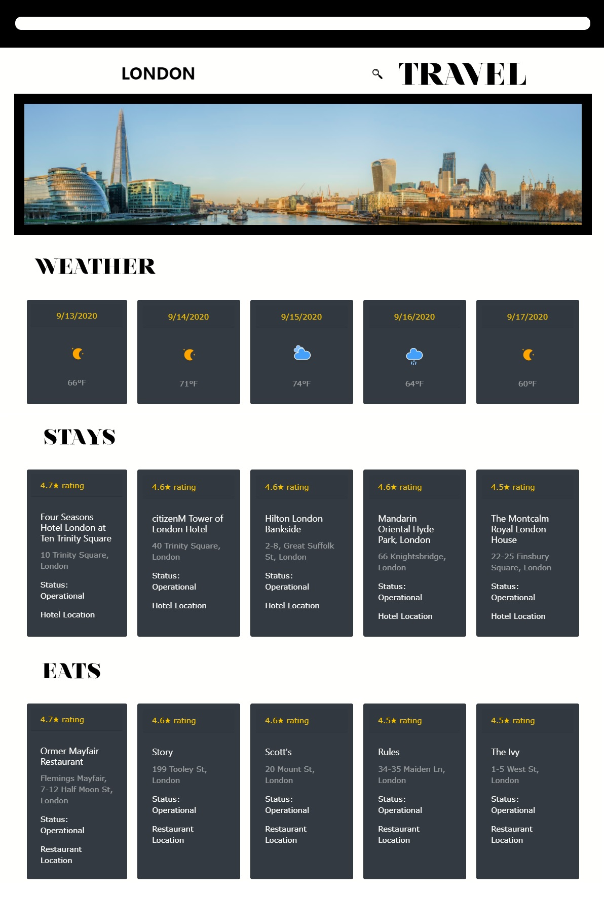

# Travel Dashboard
Plan your trips with ease and peace of mind. Search a metropolitan city to travel to and have an overview of what the city's weather forecast in the next 5-days. See the top 5 rated places to eat and stay. Be a travel expert with this travel dashboard. 

## Functionality
1. After typing in my city and searching
    * I am presented with the city's top 5 rated hotels, restaurants and a 5-day weather forecast.
2. Upon submitting city name.
    * It's saved into local storage and displayed in your past searches next time you visit the app.
3. When I click a specific restaurant or hotel.
    * I am redirected to the hotel or restaurant's map location.
4. When I click the search button on the city display page.
    * A modal where I can input a different city to search for will pop up and you can do the process over again.

## Created using
* HTML v5
* CSS v3
* JavaScript v1.8.5
* Bootstrap v4.3.1
* [amCharts icons](https://www.amcharts.com/free-animated-svg-weather-icons/)
* [Nouvelle Vague by Dirk Schuster](https://www.dafont.com/nouvelle-vague.font)

## API used
* https://developers.google.com/places/web-service/search
* https://developers.teleport.org/api/
* https://openweathermap.org/forecast16
* https://openweathermap.org/weather

## Link to Website
https://itsrheine.github.io/Travel-Dashboard/

## Link to Repository
https://github.com/itsrheine/Travel-Dashboard

## Contribution
Created by: 
* David Joaquin ([daejo](https://github.com/daejo)) 
    * Hotel search API function.
    * City image search API function.
    * Image and icon assets.
    * ReadMe documentation.
    * Splash page mobile responsiveness
* Mahmoud Abdulrhman ([MahmoudAbdulrhman](https://github.com/MahmoudAbdulrhman)) 
    * Restaurant search API function.
    * Header styling and mobile responsiveness.
    * Placeholder city stock photo function. 
* Marrione Nguyen ([itsrheine](https://github.com/itsrheine)) 
    * Weather API function.
    * Event listener search function.
    * Modal functionality.
    * Load and save function.
    * Search result mobile responsiveness.

## Screenshot

